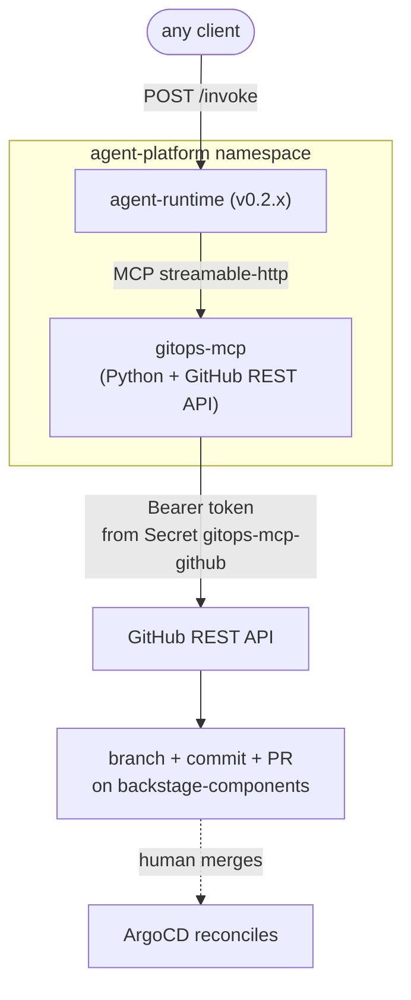

# Lab 2: gitops-mcp + Skill + Hook

In Lab 1 the agent could talk and write to its own memory but had no way to act on the platform. This lab gives it the bridge from observation to action: a domain-scoped MCP server that exposes a single mutation tool — open a pull request — plus a skill that encodes the procedure for the most common platform fix and a Strands hook that enforces governance in code, not in the prompt.

By the end, asking the agent *"my-first-app is failing with ImagePullBackOff, fix it"* triggers: skill discovery, manifest read, image-tag diagnosis, PR open, hook validation, response with the PR URL.

## Prerequisites

- Lab 1 completed (agent-runtime running in `agent-platform`, identity files mounted, MEMORY.md persisting).
- The chapter-05 ApplicationSet still active and pointed at `lusoal/backstage-components`.

## Architecture



Both the agent and the MCP server live in the same `agent-platform` namespace. The agent talks to the MCP server through the cluster Service `gitops-mcp.agent-platform.svc.cluster.local:8080`. The MCP server talks to GitHub directly with a token mounted from a Kubernetes Secret.

## What this lab adds

| Piece | Where it lives | Purpose |
|---|---|---|
| `gitops-mcp:0.1.0` image | `files/gitops-mcp/` | New domain MCP server. 2 tools: `read_file`, `open_pull_request`. Uses GitHub REST API directly — no `git` binary in the container. |
| `agent-runtime:0.2.x` image | `files/agent/` | Adds: MCP client (connects to gitops-mcp at startup), skills loader (discovers folders under `/state/skills/`), `consult_skill` tool (progressive disclosure), `AlwaysPRHook` (governance). |
| `fix-image-tag` skill | `files/skills/fix-image-tag/SKILL.md` | Procedure the agent should follow when a workload reports ImagePullBackOff. Mounted into the agent at `/state/skills/fix-image-tag/SKILL.md` from a ConfigMap. |
| `AlwaysPRHook` | `files/agent/app/hooks.py` | Strands hook that intercepts every `BeforeToolCallEvent` and validates `open_pull_request` calls. Rejects PRs whose title doesn't start with `[agent]` or whose body is shorter than 20 characters. |
| K8s manifests | `files/components-repo/agent-platform/k8s/` | New: `gitops-mcp-{deployment,service,serviceaccount}.yaml`, `configmap-skills.yaml`. Updated: `deployment.yaml` (image bump, new env vars, new volume mount). |

## Step 1: Build the new images

```bash
# agent-runtime v0.2.x
cd files/agent
docker build -t agent-runtime:0.2.1 .
kind load docker-image agent-runtime:0.2.1 --name agentic-platform

# gitops-mcp v0.1.0
cd ../gitops-mcp
docker build -t gitops-mcp:0.1.0 .
kind load docker-image gitops-mcp:0.1.0 --name agentic-platform
```

If you are not on kind, push to a registry your cluster can pull from and update the `image:` lines in the manifests accordingly.

## Step 2: Create the GitHub token Secret out-of-band

`gitops-mcp` calls the GitHub REST API with a token mounted from a Secret named `gitops-mcp-github` in the `agent-platform` namespace. Like the LLM credentials in Lab 1, this Secret is **not** committed to git.

Quickest path (reuses your `gh` CLI token, scope = your full GitHub permissions — fine for a local demo, replace with a fine-grained PAT scoped to the components repo for anything resembling production):

```bash
kubectl create secret generic gitops-mcp-github \
  -n agent-platform \
  --from-literal=GITHUB_TOKEN="$(gh auth token)" \
  --dry-run=client -o yaml | kubectl apply -f -
```

## Step 3: Ship the manifests through GitOps

Copy the contents of `files/components-repo/agent-platform/k8s/` over your existing `agent-platform/k8s/` in the `backstage-components` repo. Five files change in this lab:

```
agent-platform/k8s/
├── configmap-skills.yaml          # NEW (mounts the SKILL.md)
├── deployment.yaml                # UPDATED (image 0.2.1, MCP_GITOPS_URL env, skills volume)
├── gitops-mcp-deployment.yaml     # NEW
├── gitops-mcp-service.yaml        # NEW
└── gitops-mcp-serviceaccount.yaml # NEW
```

Open a PR, merge it. Within ~3 minutes ArgoCD reconciles: the gitops-mcp Pod starts, the agent-runtime Pod is recreated with the new image and connects to gitops-mcp at startup.

```bash
kubectl -n agent-platform get pods -w
# Expect: agent-runtime-... 1/1 Running   gitops-mcp-... 1/1 Running
```

## Step 4: Verify the MCP connection from the agent's logs

```bash
kubectl -n agent-platform logs deploy/agent-runtime --tail=30 | grep -E "gitops|skill|tool"
```

You should see lines like:

```
{"name": "agent.mcp", "message": "starting gitops-mcp client", "url": "http://gitops-mcp.agent-platform.svc.cluster.local:8080"}
{"name": "agent.mcp", "message": "gitops-mcp tools loaded", "count": 2, "names": ["read_file", "open_pull_request"]}
```

And the gitops-mcp logs should show streamable-http session traffic from the agent's pod IP.

## Step 5: Smoke test — confirm the agent sees the new capabilities

```bash
kubectl -n agent-platform port-forward svc/agent-runtime 18080:80 &
curl -sS -X POST http://localhost:18080/invoke \
  -H 'Content-Type: application/json' \
  -d '{"intent": "List the skills you have loaded and the tools available.", "session_id": "lab2-smoke"}'
```

Expected: a response that names `fix-image-tag` as a discovered skill and lists `read_file`, `open_pull_request`, `consult_skill`, `save_to_memory` as available tools.

## Step 6: Drive the demo

Break a deployment manually (simulating a developer typo) and ask the agent to fix it.

```bash
# In your local clone of lusoal/backstage-components:

# macOS (BSD sed): empty quoted string after -i
sed -i '' 's|nginx:alpine|nginx:bogus-tag-does-not-exist|' my-first-app/k8s/deployment.yaml
# Linux (GNU sed): no argument after -i
# sed -i  's|nginx:alpine|nginx:bogus-tag-does-not-exist|' my-first-app/k8s/deployment.yaml

git checkout -b demo/break-image
git commit -am "demo: break image tag"
git push -u origin demo/break-image
gh pr create --fill && gh pr merge --merge --delete-branch
```

Wait ~3 minutes for ArgoCD to apply the bad image. `kubectl -n default get pods -l app=my-first-app` will show the new pod in `ErrImagePull`.

Now invoke the agent:

```bash
curl -sS -X POST http://localhost:18080/invoke \
  -H 'Content-Type: application/json' \
  -d '{
    "intent": "my-first-app is failing with ErrImagePull / ImagePullBackOff. The deployment lives at my-first-app/k8s/deployment.yaml in the GitOps repo. Diagnose and open a PR to fix it.",
    "session_id": "demo-fix",
    "user_id": "user:default/guest"
  }'
```

Expected: response references a new PR opened against `lusoal/backstage-components`, with title `[agent] fix my-first-app image tag in default` and a body that explains the symptom, the change, and the rationale.

Open the PR in GitHub, review, merge. Within ~3 minutes ArgoCD reconciles and `my-first-app` returns to `Running 2/2`.

## What you just demonstrated

Each section of Chapter 6, exercised end-to-end:

- *Memory in two layers*: SOUL/IDENTITY/USER from a ConfigMap (deliberate, GitOps-versioned, RO) plus MEMORY.md on a PVC (deliberate, agent-writable, persists across pod restarts).
- *Skills as Procedural Knowledge*: the agent loads `SKILL.md` metadata at boot via progressive disclosure, then pulls the full body via `consult_skill` only when the user's intent matches.
- *Domain-Scoped MCP Servers*: gitops-mcp is the bridge from observation to action. It's the only mutation surface the agent has.
- *Governed Writes via Hooks*: `AlwaysPRHook` runs in code on every tool call. It rejects bad PR titles or bodies regardless of what the prompt says.
- *Bounded blast radius*: the agent never touches the cluster. Every change goes through `open_pull_request` → human review → merge → ArgoCD reconcile.
- *The recursive moment of Chapter 6*: the agent's own deployment is updated by the same ApplicationSet that ships my-first-app — the platform that deploys the agent is the platform the agent later consumes.

## Troubleshooting

**Agent logs `EventLoopException: "Attempt to overwrite 'X' in LogRecord"`** — Python `logging` reserves several keys on `LogRecord` (e.g. `args`, `name`, `message`, `module`). Rename the offending key in your `extra={...}` dict.

**`gitops-mcp tools loaded count=0`** — the agent connected to the MCP server but no tools were registered. Confirm `gitops-mcp` is healthy (`kubectl logs deploy/gitops-mcp`) and that `MCP_GITOPS_URL` resolves from the agent pod (`kubectl -n agent-platform exec deploy/agent-runtime -- nslookup gitops-mcp`).

**Agent opens a PR but the hook rejects it** — look at the response. Common causes: title without `[agent]` prefix; body shorter than 20 characters. The system prompt should already discourage these — the hook is the enforcement floor.

**`gitops-mcp` returns 401 from GitHub** — the `gitops-mcp-github` Secret is missing or the token has insufficient scopes. The token needs `Contents: rw` and `Pull requests: rw` on the components repo at minimum.

## Next

Lab 3 wires the existing chapter-05 GenAI chat plugin to call this agent so users can drive the demo from the Backstage sidebar, and Lab 4 adds Langfuse plus a hash-chained audit log.
