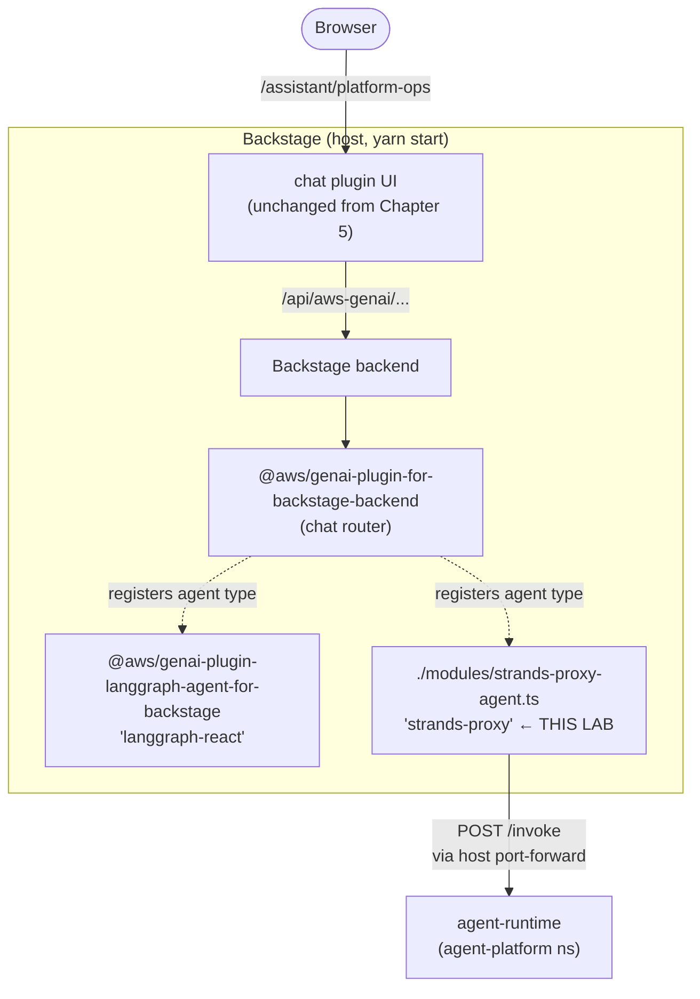

# Lab 3: Wire Backstage to the Strands Agent

In Lab 1 the agent runs as a separate service. In Lab 2 it gained the tools and skill to actually open PRs. But the only way to talk to it has been `curl`. This lab wires the existing Chapter 5 chat plugin to the agent — so a user just opens a sidebar item in Backstage and chats. No new frontend code; we extend the GenAI plugin with one Backstage backend module that registers a new agent type.

By the end, the Backstage sidebar shows two chat agents side by side:

- **Chat Assistant** — the original langgraph-react agent from Chapter 5 (model loop in-process).
- **Platform Agent** — proxies HTTP `POST /invoke` to the Strands runtime in the cluster. The trigger source from Figure 6.3, made literal.

## Prerequisites

- Lab 2 completed. `kubectl -n agent-platform get pods` shows `agent-runtime` and `gitops-mcp` both Running.
- A port-forward (or other route) from your host to the agent's Service. For local dev:
  ```bash
  kubectl -n agent-platform port-forward svc/agent-runtime 18080:80 &
  ```
  Production substitutes: an Ingress, a Service of type LoadBalancer, or — when Backstage itself runs in the cluster — the in-cluster Service DNS `http://agent-runtime.agent-platform.svc.cluster.local`.

## How it works

The AWS GenAI plugin core (`@aws/genai-plugin-for-backstage-backend`) exposes an `agentTypeExtensionPoint`. The `langgraph-react` agent type is itself a separate module (`@aws/genai-plugin-langgraph-agent-for-backstage`) that registers with this extension point. Anyone can write a parallel module that registers a new agent type. That's exactly what this lab does:



When the chat plugin streams a response, the `langgraph-react` agent type runs the LLM in-process. The `strands-proxy` agent type instead does an HTTP POST to the Strands runtime, gets the response back, and emits it as a single `ChunkEvent` followed by a `ResponseEvent`. The chat UI doesn't know the difference.

## Step 1: Drop in the Backstage backend module

Copy the file into the Backstage app you scaffolded in Chapter 5. Replace `BACKSTAGE_APP` with the absolute path to your app (e.g. `~/Documents/book-ai-for-plaform-engineering/my-backstage-app`):

```bash
BACKSTAGE_APP=~/Documents/book-ai-for-plaform-engineering/my-backstage-app
cp files/strands-proxy-agent.ts \
   "$BACKSTAGE_APP/packages/backend/src/modules/strands-proxy-agent.ts"
```

The module is ~110 lines. Highlights:

- Implements the `AgentType` interface (stream + generate) by forwarding to `${url}/invoke`.
- Registers itself under the type name `strands-proxy` via `agentTypeExtensionPoint.addAgentType(...)`.
- Reads `strands-proxy.url` from each agent's section in `app-config.yaml`.

Real streaming (token-by-token) is left as an exercise; this single-shot adapter emits the whole Strands response as one chunk. To make Strands stream natively, change its `/invoke` to return SSE and adjust the adapter to parse chunks.

## Step 2: Register the module in the backend

Edit `packages/backend/src/index.ts` and add the import line below your other module registrations:

```typescript
// Strands proxy agent (chapter-06 lab 3)
backend.add(import('./modules/strands-proxy-agent'));
```

## Step 3: Add the platform-ops agent to app-config.yaml

When you have **more than one** agent type registered, the GenAI plugin requires every agent in `genai.agents` to specify `type:` explicitly. Add `type:` to your existing `general` agent and a new `platform-ops` agent for the Strands proxy:

```yaml
genai:
  registerCoreActions: true
  agents:
    general:
      type: langgraph-react           # <-- now required (was implicit)
      description: General chat assistant
      prompt: >
        You are an expert in platform engineering...
      langgraph:
        messagesMaxTokens: 150000
        bedrock:
          modelId: us.anthropic.claude-sonnet-4-5-20250929-v1:0
          region: us-west-2
      actions:
        - get-catalog-entity
        - search-catalog
        - search-techdocs
        - kubectl_get_pods
        - kubectl_get_deployments
        - kubectl_get_services
        - kubectl_describe_pod

    # NEW
    platform-ops:
      type: strands-proxy
      description: Platform operations agent (proxy to Strands runtime)
      prompt: >
        Routed to the Strands agent runtime running in the agent-platform namespace.
        Use this agent for cluster-level fixes that require GitOps PRs.
      strands-proxy:
        url: http://localhost:18080
```

The `prompt:` on `platform-ops` is essentially ignored — the system prompt that drives the model lives in `SOUL.md` / `IDENTITY.md` / `USER.md` inside the agent runtime. Backstage's `prompt` field is required by the plugin but the proxy adapter doesn't forward it.

## Step 4: Add a sidebar item

Edit `packages/app/src/components/Root/Root.tsx` and add a `<SidebarItem>` for the new agent next to the existing one:

```tsx
import { ChatIcon, /* existing imports */ } from '@backstage/core-components';

// inside the Menu <SidebarGroup>:
<SidebarItem icon={ChatIcon} to="assistant/general"      text="Chat Assistant" />
<SidebarItem icon={ChatIcon} to="assistant/platform-ops" text="Platform Agent" />
```

(If you used a different icon for "Chat Assistant", reuse it or pick another from `@material-ui/icons`.)

## Step 5: Restart Backstage

Kill any running `yarn start` first (the backstage-cli watcher reloads file changes inside one process, but adding a new module that's pulled in by `index.ts` requires a full restart):

```bash
pkill -f "yarn start"; pkill -f "backstage-cli"
sleep 2
# In the my-backstage-app directory, with Node 22 and your AWS env vars set:
NODE_OPTIONS=--no-node-snapshot yarn start
```

The backend log should now contain:

```
[aws-genai] Creating agent 'general'
[aws-genai] Instantiating langgraph-react gent general using model 'ChatBedrockConverse'
[aws-genai] Creating agent 'platform-ops'
[aws-genai] [strands-proxy] registered agent platform-ops url=http://localhost:18080
[backstage] Plugin initialization complete, newly initialized: ... 'aws-genai' ...
```

If you see `Agent type not specified for agent X`, you forgot to add `type:` to one of the agents in app-config.yaml. If you see `Unknown agent type Y`, the type name doesn't match what either module registered (langgraph-react / strands-proxy).

## Step 6: Try it in the UI

Open `http://localhost:3000`. The sidebar shows two chat items now. Click **Platform Agent** and ask:

> *my-first-app is failing with ImagePullBackOff. The deployment lives at my-first-app/k8s/deployment.yaml in the GitOps repo. Diagnose and open a PR to fix it.*

The response will reference a new pull request opened against `lusoal/backstage-components` — the same flow you ran via `curl` in Lab 2, now triggered from a chat UI a non-engineer could use.

## Why this matters for the chapter

Two things the rest of Chapter 6 depends on:

1. **Independence.** The Strands runtime didn't change. It still scales, restarts, redeploys, rolls back independently of Backstage. The chat plugin is just one of many possible trigger sources (Slack bot, cron, ArgoCD notification webhook, custom CLI — the contract is `POST /invoke`).
2. **Two stages of the spectrum, one platform.** The sidebar now contains both a Stage-2 in-process langgraph agent (deterministic at the wire level, the model is a tool you call) and a Stage-4 autonomous agent (model directs orchestration). Same chat UX, very different blast radius and operating cost. The chapter's *Workflow vs Agent: A Spectrum of Determinism* section, made visible.

## Troubleshooting

**`Agent type not specified for agent X`** — when more than one agent type is registered, every agent in `genai.agents` must specify `type:` explicitly. Add `type: langgraph-react` to your existing agents and `type: strands-proxy` to the new one.

**`Unknown agent type Y`** — the type name in YAML doesn't match what a module registered. The langgraph module registers `langgraph-react`; this lab's module registers `strands-proxy`.

**Chat hangs, agent log shows no incoming requests** — port-forward dropped (it falls when the pod restarts). Re-run the port-forward and refresh the chat.

**`Could not reach Strands runtime`** in the chat response — the URL in app-config.yaml doesn't match the port-forward target. Check `lsof -nP -iTCP:18080 -sTCP:LISTEN` to confirm the port-forward is up.

## What's next

Lab 4 adds Langfuse traces and a hash-chained audit log so the agent's reasoning becomes inspectable per session. Lab 5 puts the whole loop together with screenshots and expected outputs.
