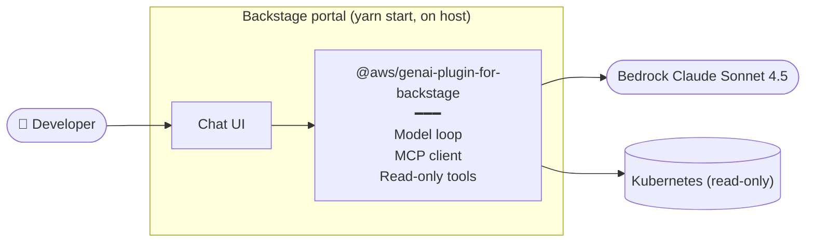
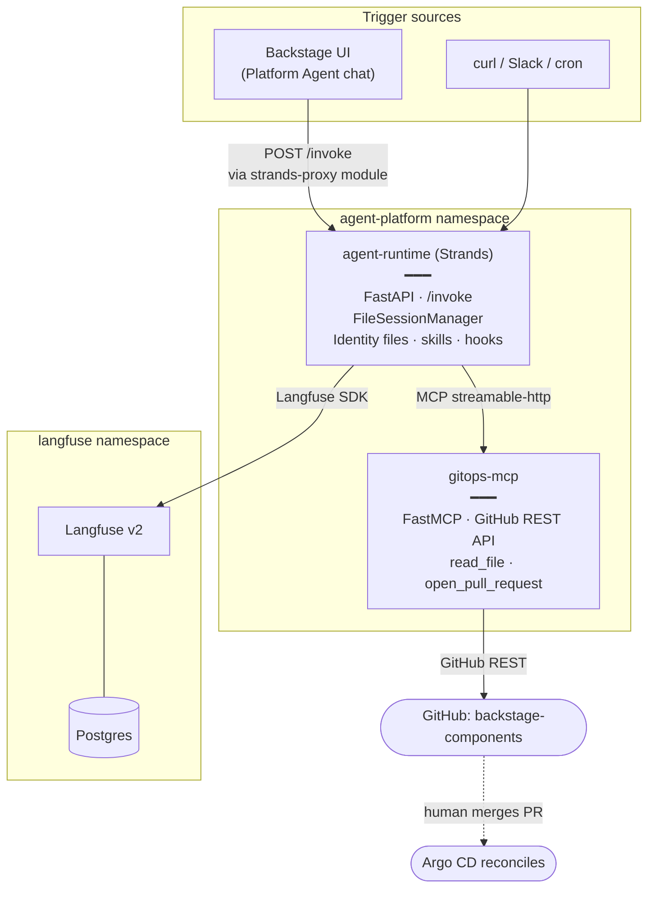
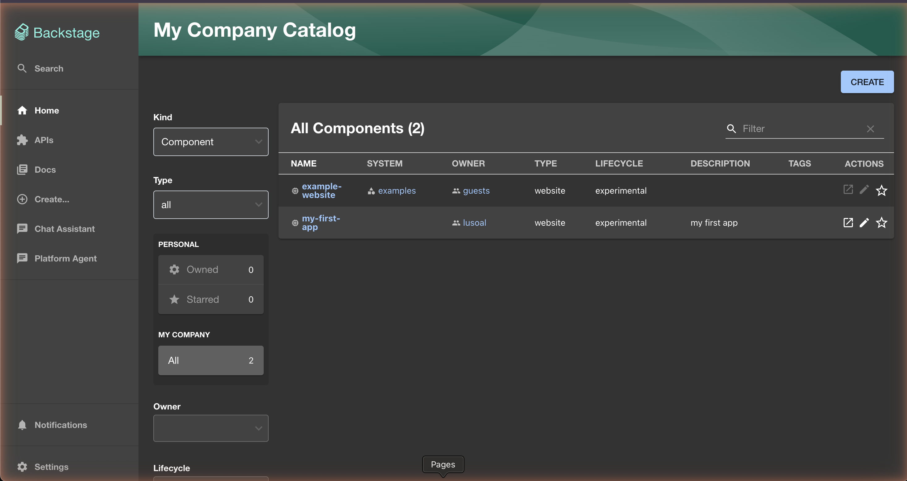
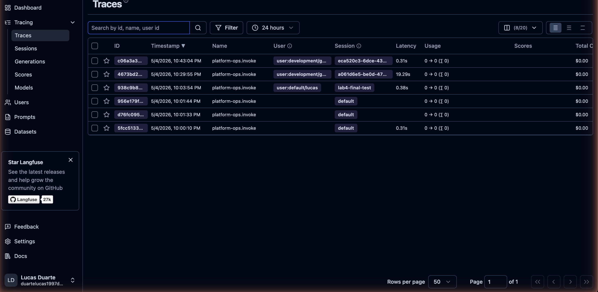
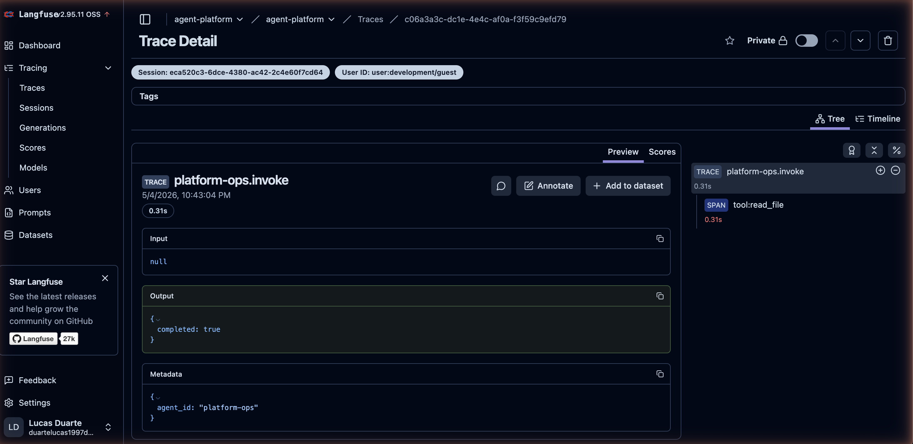
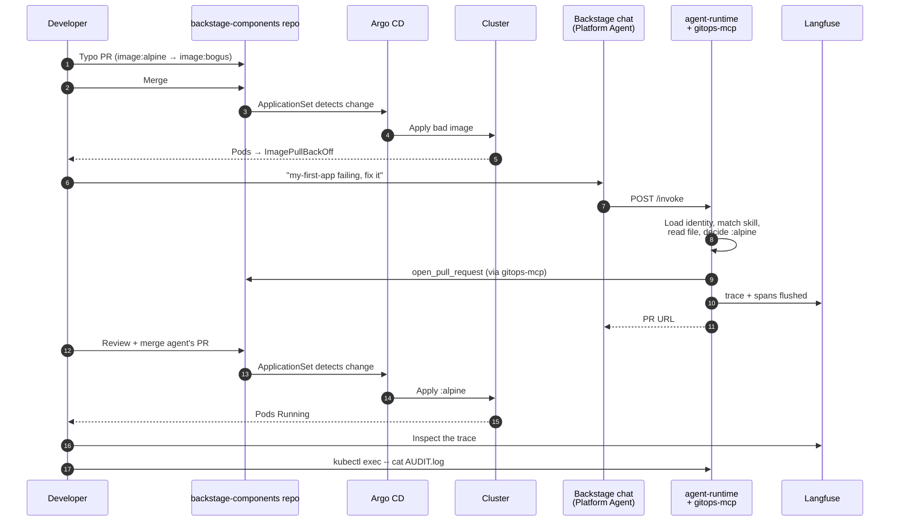
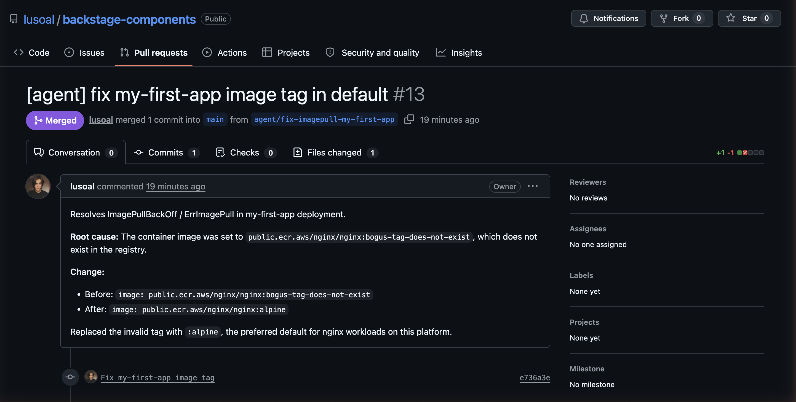

# Building It: From Insight to Action with Strands

Chapter 5 ended with a conversational interface that could read the platform: catalog entries, technical documentation, and Kubernetes runtime state through a read-only MCP server, all of it served from the chat plugin embedded in Backstage. The boundary was deliberate. Reading is observation; writing is action; action has blast radius. The interesting work begins where Chapter 5 stopped.

The next step is not to add write capabilities to the existing chat plugin — which would keep the agent embedded inside Backstage as a feature of the portal — but to **decouple**. The agent becomes a first-class citizen: a separate runtime in its own namespace, memory it owns and writes to, an MCP server that speaks GitHub directly, governance enforced in code, and an immutable audit log it cannot rewrite. Every concept from this chapter shows up in the architecture, not because we are forcing it, but because each one earns its place the moment the assistant tries to do something.

The walkthrough that follows is grounded. The reference implementation we describe runs end-to-end on a local `kind` cluster — built, deployed through the same Argo CD ApplicationSet from Chapter 5, and exercised through a real demo where a developer's typo on `my-first-app` is fixed by the agent through a real pull request. Every lab artifact, every manifest, every screenshot in this section comes from that running system; the code lives in the `chapter-06` directory of the book repository[^repo-ch6].

## What We Build, and What We Don't

A clarifying note before the architecture. The chapter argues that production agents need *four* domain MCP servers (catalog, gitops, cluster-ops, observability), self-invocation through an event bus, identity propagation across hops, and a multi-agent topology aligned to domain ownership. Building all of that in book form would obscure the patterns under the volume.

So the demo makes three deliberate cuts:

- **One MCP server, not four.** We build `gitops-mcp` — the bridge from observation to action — and explain how the other three would fall out of the same pattern. The architecture is identical; the surface area is smaller.
- **No self-invocation.** The agent runs synchronously from an HTTP `POST /invoke`. The cron-triggered loop with `agent_action` filtering is documented in the *Scheduling and self-invocation* section but left as an extension exercise.
- **Single-tenant identity.** The agent runs under one ServiceAccount with one GitHub PAT. Multi-tenant identity propagation (OIDC token exchange, `AssumeRoleWithWebIdentity`, SPIFFE) is the work of Chapter 9.

Everything else lands. Memory in two layers, skills as procedural knowledge, governed writes via hooks, observability and audit, and — the reason a book demo can credibly stop here — a recursive moment that pays for the rest of the chapter. *The agent itself is deployed by the same ApplicationSet it later consumes.* The platform that ships my-first-app is the platform that ships the agent that fixes my-first-app. That is the chapter's argument made literal in code.

## Where We Start

The Chapter 5 architecture, simplified, looks like this. The chat lives inside Backstage, the LLM call, the MCP client, and the tool execution all happen inside the portal's plugin runtime.



This is a fine starting point and a problematic ending point. Three things are wrong with it as a production agent. The plugin *is* the agent — if we want to run the same agent from a Slack message, an alert, or a scheduled job, we have to rebuild it. The plugin's identity is the user's session — if we want the agent to act on its own, there is no identity to act under. And the MCP integration is one tool collection in one process — there is no way to scope domains independently or to have specialist agents talk to specialist tool sets. We hit every issue we discussed in *Specialist agents and the cycle of architecture* the moment we try to scale beyond one user in one browser tab.

## Where We Are Going

The decoupled architecture moves the agent out of the portal and treats Backstage as one of several interfaces into a service that lives on its own. Two namespaces, two pods each, all deployed through Argo CD from the same `backstage-components` repo Chapter 5 set up:



Three changes are doing the work. First, the agent runtime is a service the portal calls, not a plugin it loads — the portal's GenAI plugin gets a new agent type (`strands-proxy`) that forwards messages to the runtime over HTTP. Second, the only mutation surface is `gitops-mcp`; the agent never touches the cluster. Third, memory and audit live outside the agent process — memory in a `ConfigMap` (deliberate, GitOps-versioned) plus a `PVC` (the agent's own writable file), audit in a hash-chained file on a separate `PVC`. Each of these is a direct application of an earlier section, so the rest of the walkthrough follows them in order, one lab at a time.

Five labs. The first four build pieces; the fifth runs the loop end-to-end against the system we just built.

## Lab 1: A Strands Agent as a Service

The first move is to take the loop out of the plugin and put it behind an HTTP endpoint. Strands makes this short. The `Agent` constructor takes a model (Bedrock Claude Sonnet 4.5 by default; Anthropic API supported as a fallback), a system prompt, a list of tools, and a `FileSessionManager` pointing at a directory on disk. A FastAPI process exposes `POST /invoke` taking an intent — typed by a developer in Backstage, sent by Slack, fired by `curl`, dispatched by a job — and returns the agent's response. The portal is now a *client* of the agent, not its host.

Two things matter for what follows:

- **The system prompt is built, not a static string.** It is composed at every invocation from the agent's identity files (`SOUL.md`, `IDENTITY.md`, `USER.md`) and the live contents of `MEMORY.md`. The model reasons over a prompt that reflects the platform's current self-conception of the agent, not a snapshot from when the container was built.
- **The deliberate memory is two storage classes, deliberately.** `SOUL.md`, `IDENTITY.md`, and `USER.md` mount from a `ConfigMap` that lives in the GitOps repo — read-only to the running pod, edited through pull requests. `MEMORY.md` mounts from a `PersistentVolumeClaim` — writable to the running pod, persistent across pod restarts, never edited from outside.

The two-storage-class split makes the *deliberate vs. automatic* memory distinction from the chapter literal. To soften the agent's tone, you open `SOUL.md` in the components repo, edit a sentence, open a PR, merge — Argo CD updates the ConfigMap and the next invocation reflects the change. To record a fact the agent learned, the model calls a `save_to_memory(fact)` tool that appends a line to `/state/memory/MEMORY.md` on the PVC. *Memory the platform owns* is in Git. *Memory the agent owns* is on a volume the agent writes to with explicit intent. The chapter calls this two-layer pattern; here it is two Kubernetes objects.

A third storage class — `emptyDir` for the `FileSessionManager` — is the conversational scratch, ephemeral by design. Strands handles compaction; the lifetime is the pod's.

We verified the loop end-to-end on the running cluster:

1. `POST /invoke` with intent *"Tell me in one sentence who you are and the single hardest constraint you must follow."*
   The agent answered: *"I am the platform agent for a Backstage/ArgoCD developer platform, and my hardest constraint is that I never apply changes to the cluster directly — every change must go through a pull request on the GitOps repository."* The constraint comes from `SOUL.md`. The role comes from `IDENTITY.md`. The system prompt assembled them.

2. `POST /invoke` with intent *"Remember for future sessions that the preferred default container image tag for nginx is :alpine."*
   The agent called `save_to_memory`. `kubectl exec -- cat /state/memory/MEMORY.md` shows the line on the PVC.

3. New session, fresh `session_id`, *"What is the preferred default tag for nginx?"*
   The agent quoted `:alpine` directly from `MEMORY.md` — the system prompt re-loaded the file at the start of the new invocation.

4. `kubectl delete pod -l app=agent-runtime`. New pod schedules, `MEMORY.md` is still there because PVC. Memory survives the pod, exactly as the chapter argued deliberate long-term memory should.

The recursive moment Lab 1 buys you: this entire deployment ships through the same `backstage-app-discovery` ApplicationSet from Chapter 5, by adding an `agent-platform/` folder to the components repo. The agent's manifests sit alongside `my-first-app/` in the same Git tree. *The platform deploys the agent through the platform's own paved road.* That is the property production-grade agents need; that is the property a book demo on a `kind` cluster can show.

## Lab 2: gitops-mcp + Skill + Hook

Lab 1 gave the agent a body but no hands. Lab 2 wires the bridge from observation to action: a domain MCP server, one skill, and one Strands hook.

**The MCP server.** `gitops-mcp` is a small Python service that speaks the Model Context Protocol over streamable HTTP, exposes two tools, and talks to GitHub through the REST API directly — no `git` binary in the container, no working tree to keep clean. The two tools are `read_file(path)` and `open_pull_request(branch, file_path, content, commit_message, title, body)`. Behind the scenes, `open_pull_request` does four GitHub API calls in sequence: get current file SHA, create a branch from `main`, commit a single-file edit on the branch, open the PR. The tool returns the PR URL and number to the agent. The PAT comes from a Kubernetes `Secret` mounted as `envFrom`; the components repo URL is configured per-environment.

The pattern is the one the chapter promised. *One MCP server per platform domain.* `gitops-mcp` is the gitops domain. A `catalog-mcp` for Backstage queries, a `cluster-ops-mcp` for read-only kubectl, and an `observability-mcp` for metrics/logs would each follow the same structure: independent image, independent ServiceAccount, independent Secret with a domain-scoped credential, independent Service. Three additional pods of identical shape; an architecture decision left as an extension exercise rather than a duplication of code.

**The skill.** `fix-image-tag/SKILL.md` is YAML frontmatter (name, description, *when to use*, hard constraints) followed by a numbered procedure: identify the target component and namespace, call `read_file` on `<component>/k8s/deployment.yaml`, decide the fix (with explicit guidance to fall back on `MEMORY.md` defaults and to *stop and ask the user* when it cannot identify a safe replacement), call `open_pull_request` with a `[agent] <verb> <resource> in <namespace>` title and a Symptom/Root cause/Before-After/Rationale body. The skill mounts into the agent's pod from a `ConfigMap` at `/state/skills/fix-image-tag/SKILL.md`. At startup the agent indexes the metadata of every skill — name, description, *when to use* — into the system prompt; the full body is loaded only when the model decides this skill matches the intent and calls `consult_skill("fix-image-tag")`. The chapter's *progressive disclosure* discussion lands as a tool call.

**The hook.** Strands hooks intercept tool calls in code. `AlwaysPRHook` subscribes to `BeforeToolCallEvent` and, when the tool being called is `open_pull_request`, validates the title (must start with `[agent] `) and the body (must be at least 20 characters of rationale). When validation fails, the hook sets `event.cancel_tool` to a message, the call never executes, and the agent receives the rejection as a tool result it can reason about and retry. This is the difference between a system prompt that says *"always title PRs as [agent]"* and code that runs whether or not the model paid attention. *The data point — 100% enforcement vs 82.5% for prompt-only — does not change because we wrote the hook in eight lines.*

Stitching the three together: the agent now has four tools available — `save_to_memory` and `consult_skill` (local), `read_file` and `open_pull_request` (from `gitops-mcp` via the MCP client) — one skill registered with metadata only, two hooks running on every tool call (the always-PR hook plus an audit hook we add in Lab 4). The agent can read manifests in the components repo and propose changes, and only changes; nothing else.

We exercised the loop end-to-end on the running cluster:

```bash
# Break my-first-app deliberately (a developer typo)
sed -i '' 's|nginx:alpine|nginx:bogus-tag-does-not-exist|' my-first-app/k8s/deployment.yaml
gh pr create --fill && gh pr merge --merge --delete-branch

# Wait ~3 min for Argo CD to apply the bad image; pods go ImagePullBackOff

# Ask the agent to fix it
curl -s -X POST http://localhost:18080/invoke \
  -H 'Content-Type: application/json' \
  -d '{"intent": "my-first-app is failing ImagePullBackOff. Fix it.",
       "session_id": "demo-fix",
       "user_id": "user:default/guest"}'
```

The agent reasoned, called `read_file`, identified the bad tag, called `open_pull_request`, the hook validated, the PR opened. The chat (and the `curl` output) returned the PR URL. Title: `[agent] fix my-first-app image tag in default`. Body: Symptom / Root cause / Before / After / consequence. Diff: a single line, `bogus-tag-does-not-exist` to `alpine`. Merge, Argo CD reconciles, the workload heals. *The agent's blast radius is whatever the human approves; the agent's reach into the cluster is exactly zero.*

## Lab 3: Wiring Backstage to the Agent

The agent works. The only client is `curl`. Lab 3 is the chapter's Figure 6.3 made literal: Backstage as a trigger source for the agent runtime.

The Chapter 5 GenAI plugin has an extension point — `agentTypeExtensionPoint` — that any backend module can register a new agent type with. The `langgraph-react` agent type from the chapter-5 chat is itself a separate module (`@aws/genai-plugin-langgraph-agent-for-backstage`) that registers through this extension point. Anyone can write a parallel module that registers another agent type. This lab is exactly that.

The module — `strands-proxy-agent.ts`, ~110 lines of TypeScript — registers `strands-proxy` as a new agent type. When the GenAI plugin asks an agent of this type to handle a chat turn, the module makes an HTTP `POST` to the URL it was configured with (the agent runtime's port-forward in dev, the in-cluster Service DNS in production), and adapts the single-shot JSON response back into the `ChunkEvent` + `ResponseEvent` stream the chat UI expects. Real per-token streaming is left as an exercise; the single-chunk adapter is enough for the chat to feel right.

The configuration in `app-config.yaml` defines two agents now, both consumed by the same chat UI:

```yaml
genai:
  agents:
    general:                       # chapter-5 way: in-process langgraph
      type: langgraph-react
      langgraph:
        bedrock:
          modelId: us.anthropic.claude-sonnet-4-5-20250929-v1:0
      actions: [get-catalog-entity, search-catalog, kubectl_get_pods, ...]

    platform-ops:                  # chapter-6 way: HTTP proxy to Strands
      type: strands-proxy
      strands-proxy:
        url: http://localhost:18080  # in-cluster: agent-runtime.agent-platform.svc.cluster.local
```

A second `<SidebarItem>` in `Root.tsx` adds the `Platform Agent` entry to the chat sidebar. After a restart, the user sees two chat agents side by side — *Chat Assistant* (langgraph in-process, the Chapter 5 way) and *Platform Agent* (Strands HTTP proxy, the Chapter 6 way):



The same chat UX, very different agent topology — Stage 2/3 of the determinism spectrum (a workflow with one agentic node) sitting next to Stage 4 (an autonomous agent reasoning over its own tools). The chapter's *Workflow vs Agent: A Spectrum of Determinism* section is now a sidebar with two items the user clicks between. The point isn't that one is right and the other wrong; the point is that the same Backstage portal serves both, and the platform team chooses which workload belongs on which stage of the spectrum.

We re-ran the Lab 2 demo through the chat: typo PR breaks `my-first-app`, the user opens *Platform Agent*, asks to fix it. The chat replied with the URL of PR #N. The user clicked, reviewed, merged. Argo CD reconciled. The workload was green again within five minutes of the breakage. *The full loop, driven from a Backstage chat that a non-engineer could use.* That is the democratization argument from the chapter opening, exercised against a real cluster.

## Lab 4: Langfuse Traces and a Hash-Chained Audit Log

The agent works through the chat. From the outside, the chat is the only window into what it did. Lab 4 adds the two layers the chapter's *Observability and Audit* section argued for: an LLM-aware tracing backend the operator can read like a debugger, and an append-only file the operator can verify like a flight recorder.

**Langfuse.** Two pods in their own `langfuse` namespace, deployed through the same ApplicationSet pattern: a `langfuse-postgres` `Deployment` plus PVC, and the `langfuse/langfuse:2` image as a single-container `Deployment` reading `DATABASE_URL` from the same Postgres. The langfuse and Postgres credentials are out-of-band Secrets the operator creates with `kubectl`; nothing sensitive lives in Git. First-run bootstrap is interactive — the operator opens the UI on the port-forward, creates an org and a project, and copies a `pk-lf-...` and `sk-lf-...` pair into a Secret named `agent-langfuse-keys` in the `agent-platform` namespace. The agent reads those keys from `envFrom` at the next pod restart.

**The Strands integration.** The chapter narrated this section as "Strands has first-class OpenTelemetry support" and described pointing the OTel exporter at Langfuse's OTLP endpoint. The reality, the day we wrote this, is more nuanced. *Langfuse v2 does not expose the OTLP endpoint; that landed in v3.* Self-hosted v3 ships with a heavier stack — Postgres, ClickHouse, Redis, MinIO, plus a `langfuse-web` and a `langfuse-worker` — six pods total against v2's two. We picked v2 to keep the cluster footprint reasonable, and used the official Langfuse Python SDK directly through a Strands hook. The result is the same Langfuse UI experience, the same per-trace-per-span model, the same per-session and per-user filtering. The hook is fifty lines: it subscribes to `BeforeInvocationEvent`, `BeforeToolCallEvent`, `AfterToolCallEvent`, and `AfterInvocationEvent`, and emits `client.trace(...)` and `trace.span(...)` calls accordingly. Switching to v3 + OTLP later is mechanical: drop the SDK, set `OTEL_EXPORTER_OTLP_ENDPOINT` and headers, delete the hook. *Strands does the rest.*

The trace structure the operator sees in Langfuse: one trace named `<agent_id>.invoke` per `/invoke` call, tagged with the `session_id` and `user_id` that came in on the request body (we carry both through the FastAPI handler into the hook through a Python `ContextVar`, since Strands' `BeforeInvocationEvent` doesn't surface the request directly). Inside the trace, one span named `tool:<tool_name>` per tool call, with the input arguments and the duration. Per-token cost shows up as the model emits usage; per-session cost aggregates in the Langfuse UI:



Click into a trace and the right-hand panel shows the trace tree — the root invocation and one nested span per tool call:



**The audit log.** Langfuse is the operator's debugger. The audit log is the platform's flight recorder, with stricter immutability properties. A second Strands hook — `AuditHook`, around sixty lines including the chain bookkeeping — subscribes to the same `Before/AfterToolCallEvent` and appends one JSON line per event to `/state/audit/AUDIT.log` on a separate PVC. Each record carries `prev_hash` (the SHA-256 of the previous record's body) and its own `hash`, computed deterministically from the record's other fields. Tampering with any record invalidates the chain from that record onward. Verifying integrity is twenty lines of Python:

```python
import json, hashlib
prev = '0' * 64
ok = True
with open('/state/audit/AUDIT.log') as f:
    for line in f:
        rec = json.loads(line)
        digest = rec.pop('hash')
        body = json.dumps(rec, sort_keys=True, separators=(',',':'))
        if hashlib.sha256(body.encode()).hexdigest() != digest:
            print('BAD CHAIN'); ok = False
        if rec.get('prev_hash') != prev:
            print('BAD prev_hash'); ok = False
        prev = digest
print('chain OK' if ok else 'chain BROKEN')
```

We tamper-tested it: edit one character of any record, re-run the verifier, output flips to `BAD CHAIN`. *A debug log is a draft. A hash-chained log is the same log promoted to evidence.* The chapter's immutability discussion lands in sixty lines plus a verifier.

Two layers, two threat models. Langfuse for *what the model said and how much it cost.* The audit log for *exactly which tool ran with which arguments, at what time, in what order, and whether anyone has touched the file since.* In production, the chapter's *Going to production* table substitutes Langfuse Cloud (or self-hosted v3 at scale) for the v2 deployment, and S3 with Object Lock in a separate AWS account for the local audit file — both substitutions preserve the property the demo proved.

## Lab 5: The Demo, End to End

The first four labs build pieces. Lab 5 runs the loop. With everything from 1–4 in place — the agent runtime in `agent-platform`, `gitops-mcp` next to it, Langfuse plus Postgres in their own namespace, the Backstage `strands-proxy` module wired up, the `agent-langfuse-keys` Secret applied — the full chapter-6 narrative reduces to a sequence the operator drives through the UI.

The flow:



In one continuous demo the operator sees: the workload break in Argo CD, the chat in Backstage with the agent's reply (PR URL), the PR on GitHub with the `[agent]`-prefixed title and the structured body, the trace in Langfuse with one span per tool call, the workload heal in Argo CD, and the audit log on the PVC validating its own hash chain. Every section of the chapter has a place in the room.

What the agent's PR looks like in the wild:



A short list of variants the labs cover, each exercising a different piece:

- **The hook in the act.** Edit the SKILL.md procedure to drop the `[agent]` prefix from the suggested title, redeploy, rerun the demo. The chat replies with `Hook rejected open_pull_request: title must start with '[agent] '.` instead of a PR URL. Prompt-level guidance versus code-level enforcement, made visible.
- **A skill that doesn't match.** Break the workload by setting `replicas: 0` instead of breaking the image. Ask the agent to scale it back. There is no `scale-deployment` skill installed, so the agent fails closed — quotes the *if you cannot identify a safe replacement, stop and ask* rule from `SOUL.md`, refuses to invent an action, and reports back to the user. The chapter's *fail safely* property of agent readiness, exercised on demand.
- **A second skill.** The bonus Lab 6 in the repo wraps a Backstage scaffolder template called `add-skill` that lets a domain team contribute a new skill without writing any agent code: form input → `fetch:template` → `publish:github:pull-request` → ConfigMap-mounted `SKILL.md` ships through the same GitOps pipeline. The chapter's *Workflow vs Agent* spectrum, with *templates* (Stage 1–3) and *autonomous agents* (Stage 4) coexisting in the same Backstage portal, contributed to by the same domain teams.

## Going to Production: What Changes

The architecture above is faithful to every concept in this chapter, but it makes choices a production deployment revisits. The substitutions below preserve the property the local component demonstrates while moving the operational burden somewhere managed:

| Component (local) | Production substitute | What stays the same |
|---|---|---|
| `FileSessionManager` writing to `emptyDir` | Amazon Bedrock AgentCore Memory (or a managed vector store + KV) | Two-memory pattern; deliberate vs. automatic split |
| `agent-identity` ConfigMap from Git + `MEMORY.md` PVC | S3 bucket with versioning + Object Lock for the deliberate identity, in a separate AWS account | File-based identity; auditable diffs; rollback by version |
| `gitops-mcp` as a Pod in the cluster | `gitops-mcp` as a Lambda behind an AgentCore Gateway, or a Service-mesh-policied Kubernetes service | Domain scoping; one MCP per domain; per-server scopes |
| (No event bus in the demo) | SNS topic with filter policies and SQS subscribers, or Kafka with consumer groups | The `agent_action` flag pattern; loop prevention via filter |
| Local Langfuse v2 + Python SDK | Langfuse Cloud (or self-hosted v3 with OTel) | LLM-aware tracing; per-session and per-user views |
| `AUDIT.log` on a PVC | S3 with Object Lock in compliance mode, in a separate account | Append-only; tamper-evident; hash-chained |
| Strands proxy module pointing at `localhost:18080` (port-forward) | Strands proxy module pointing at the in-cluster Service DNS, with mTLS | The proxy adapter pattern itself |

Three additional concerns become first-class in production. *Identity propagation* moves from "whoever started the local process" to OIDC token exchange, `AssumeRoleWithWebIdentity`, or SPIFFE — the patterns from the *Identity propagation* property of agent readiness, treated in depth in Chapter 9. *Bounded blast radius* moves from "the agent has the credentials this developer's PAT carries" to per-tenant rate limits, IAM permission boundaries on the Lambdas behind each MCP server, and explicit dry-run modes on every destructive operation. And the agent itself usually decomposes from one generalist into specialist agents per domain — a `diagnostic-agent`, a `remediation-agent`, a `validator-agent` — exactly the way the *Specialist agents and the cycle of architecture* section described, owned by the team that owns the domain rather than by a central AI team.

None of this changes what the agent *does*. It changes the operational substrate the agent runs on. The point of building the demo this way is that you can see and modify every part of the architecture as a file you can read. The point of the production substitutes is that you do not want to operate any of those parts yourself once the agent is real.

[^repo-ch6]: The reference implementation accompanying this section, with all five labs and the running demo, lives at <https://github.com/lusoal/ai-driven-platform-engineering/tree/main/chapter-06>.
