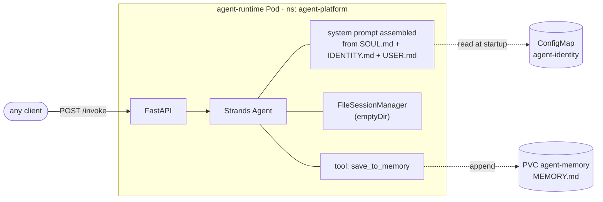
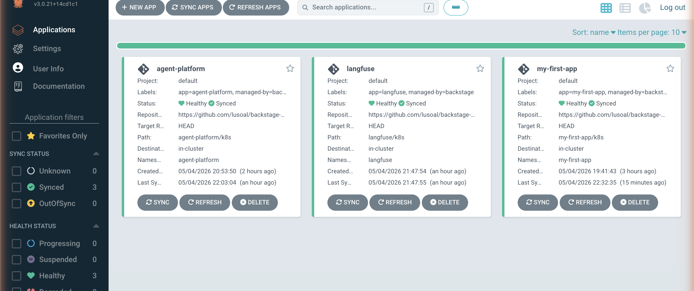

# Lab 1: A Strands Agent as a Service

In Chapter 5, the chat loop lives inside Backstage as the `@aws/genai-plugin-for-backstage` plugin. In this lab, we extract the model loop into its own service: a FastAPI process running a Strands `Agent`, with file-based identity, deployed into the cluster through the same ArgoCD ApplicationSet that ships your apps.

We do *not* remove the Chapter 5 chat plugin. It keeps working. The agent we build here is a second consumer of the platform, exposed as an HTTP endpoint that any client can call (Backstage, Slack, a cron job — the chapter calls these "trigger sources").

By the end of this lab, the agent answers HTTP `POST /invoke` calls and has no tools yet. Lab 2 wires up the `gitops-mcp` server. Lab 3 wires the Backstage chat plugin to the agent so users can drive it from the sidebar. Lab 4 adds Langfuse observability and a hash-chained audit log.

## Prerequisites

- Lab 0 passed (cluster healthy, ApplicationSet present, components repo cloned, GitHub PAT valid).
- `docker` available locally (to build the image).
- LLM credentials, either AWS for Bedrock or `ANTHROPIC_API_KEY`.

## Architecture



The split between `ConfigMap` (read-only, GitOps-versioned) and `PVC` (read-write, persisted across restarts) makes the *deliberate vs. automatic memory* distinction from the chapter literal: SOUL/IDENTITY/USER are checked into git, edited through PRs, and rolled back via `git revert`; MEMORY is appended to by the agent itself when it decides a fact is worth promoting.

## Source layout

Everything for this lab lives under `files/`:

```
files/
├── agent/                          # Container build context
│   ├── Dockerfile
│   ├── requirements.txt
│   ├── app/
│   │   ├── main.py                 # FastAPI: POST /invoke, GET /healthz
│   │   ├── agent.py                # Strands Agent factory, save_to_memory tool
│   │   ├── identity.py             # Loads SOUL/IDENTITY/USER/MEMORY into the system prompt
│   │   └── settings.py             # Env-var configuration
│   └── identity/                   # Default identity files baked into the image
│       ├── SOUL.md
│       ├── IDENTITY.md
│       └── USER.md
└── components-repo/agent-platform/  # Copy this folder into your backstage-components repo
    ├── argocd/application.yaml
    └── k8s/
        ├── namespace.yaml
        ├── serviceaccount.yaml
        ├── configmap-identity.yaml
        ├── pvc-memory.yaml
        ├── deployment.yaml
        └── service.yaml
```

## Step 1: Build the container image

From this lab's directory (`chapter-07/1-strands-runtime/`):

```bash
cd files/agent
docker build -t agent-runtime:0.1.0 .
cd ../..   # back to the lab root for the next steps
```

## Step 2: Load the image into kind

`kind` does not pull from your local Docker daemon by default. Push the image into the kind node:

```bash
kind load docker-image agent-runtime:0.1.0 --name agentic-platform
```

If your kind cluster has a different name, replace `--name agentic-platform`. If you are not using kind, push the image to a registry your cluster can pull from and update `image:` in [deployment.yaml](files/components-repo/agent-platform/k8s/deployment.yaml).

## Step 3: Create the LLM credentials Secret

This Secret is **not** committed to git. Apply it directly with `kubectl`:

**Bedrock (recommended):**
```bash
kubectl create namespace agent-platform --dry-run=client -o yaml | kubectl apply -f -
kubectl create secret generic agent-llm-credentials \
  -n agent-platform \
  --from-literal=AWS_ACCESS_KEY_ID="$AWS_ACCESS_KEY_ID" \
  --from-literal=AWS_SECRET_ACCESS_KEY="$AWS_SECRET_ACCESS_KEY" \
  --from-literal=AWS_REGION="${AWS_REGION:-us-west-2}"
```

**Anthropic API (fallback):**
```bash
kubectl create namespace agent-platform --dry-run=client -o yaml | kubectl apply -f -
kubectl create secret generic agent-llm-credentials \
  -n agent-platform \
  --from-literal=ANTHROPIC_API_KEY="$ANTHROPIC_API_KEY"
```

If using Anthropic, also edit [deployment.yaml](files/components-repo/agent-platform/k8s/deployment.yaml) before committing — change `LLM_PROVIDER` to `anthropic` and replace `BEDROCK_MODEL_ID` with `ANTHROPIC_MODEL_ID: claude-sonnet-4-5`.

## Step 4: Ship the manifests through GitOps

Copy the manifests into your `backstage-components` repository. Set `COMPONENTS_REPO` to the absolute path of your local clone:

```bash
COMPONENTS_REPO=~/work/backstage-components   # adjust to your path

cp -r files/components-repo/agent-platform "$COMPONENTS_REPO/"
```

Replace `YOUR_USERNAME` in `$COMPONENTS_REPO/agent-platform/argocd/application.yaml` with your GitHub username (same as Chapter 5):

```bash
# macOS BSD sed
sed -i '' 's/YOUR_USERNAME/<your-github-handle>/g' \
  "$COMPONENTS_REPO/agent-platform/argocd/application.yaml"
# Linux GNU sed
# sed -i 's/YOUR_USERNAME/<your-github-handle>/g' \
#   "$COMPONENTS_REPO/agent-platform/argocd/application.yaml"
```

The folder is named `agent-platform/` so that the Chapter 5 `ApplicationSet` derives `path[0] = "agent-platform"` and produces an `Application` whose `destination.namespace` matches the namespace the manifests inside declare. With any other folder name, ArgoCD would create an empty namespace named after the folder *and* deploy the resources into the namespace the manifests declare — two namespaces for one app.

Then commit and open a PR:

```bash
cd "$COMPONENTS_REPO"
git checkout -b agent-platform-initial
git add agent-platform/
git commit -m "chapter 7 lab 1: agent platform"
git push -u origin agent-platform-initial
gh pr create --fill && gh pr merge --merge --delete-branch
```

The `backstage-app-discovery` ApplicationSet from Chapter 5 picks up `agent-platform/argocd/application.yaml` within ~3 minutes and creates an `agent-platform` ArgoCD Application.

After ~3 minutes, the ArgoCD `Applications` view shows the new `agent-platform` application alongside whatever else you have running:



## Step 5: Watch ArgoCD reconcile

The `-w` flag streams updates; press Ctrl-C when the application reaches Synced + Healthy and the pod reaches Running 1/1. Both can be in the same terminal, or you can split into two:

```bash
# This usually takes ~3 minutes the first time (ApplicationSet poll interval).
kubectl -n argocd get applications agent-platform -w
# Wait until SYNC STATUS is Synced and HEALTH STATUS is Healthy, then Ctrl-C.

kubectl -n agent-platform get pods -w
# agent-runtime-... should reach Running 1/1, then Ctrl-C.
```

If the pod is `ImagePullBackOff`, the image isn't on the kind node — re-run Step 2.

## Step 6: Hit the endpoint

This needs two terminals: one to hold the port-forward, one to run `curl`.

**Terminal A — port-forward (leave running):**
```bash
kubectl -n agent-platform port-forward svc/agent-runtime 8080:80
# Forwarding from 127.0.0.1:8080 -> 8080
# (this command does not exit; switch to another terminal)
```

**Terminal B — invoke:**
```bash
curl -s -X POST http://localhost:8080/invoke \
  -H 'Content-Type: application/json' \
  -d '{"intent": "Tell me, in one sentence, who you are and what you cannot do."}' \
  | jq .
```

You should see a response that reflects the contents of [SOUL.md](files/agent/identity/SOUL.md) and [IDENTITY.md](files/agent/identity/IDENTITY.md). Try a follow-up that triggers the `save_to_memory` tool:

```bash
curl -s -X POST http://localhost:8080/invoke \
  -H 'Content-Type: application/json' \
  -d '{"intent": "Remember for future sessions that this user prefers PR titles in lowercase."}' \
  | jq .

# Then inspect MEMORY.md:
kubectl -n agent-platform exec deploy/agent-runtime -- cat /state/memory/MEMORY.md
```

The fact is on disk. The next invocation reads it back into the system prompt.

## Step 7: Edit identity through GitOps

Open [configmap-identity.yaml](files/components-repo/agent-platform/k8s/configmap-identity.yaml) in your `backstage-components` checkout. Change one rule in `SOUL.md` — for example, soften the tone instruction. Open a PR, merge it. ArgoCD updates the ConfigMap. The next `POST /invoke` reflects the change.

This is the *deliberate, version-controlled* memory pattern from the chapter, made literal: the agent's identity is a folder you can read, edit, diff, and revert with the same workflow you use for code.

## What you have

- A Strands `Agent` running in the cluster, deployed by the same ApplicationSet that deploys your apps.
- A file-based identity, mounted from a ConfigMap, version-controlled in the components repo.
- A `MEMORY.md` on a PVC that the agent appends to with explicit intent.
- A `FileSessionManager` keeping conversation state on disk between turns.
- An HTTP endpoint that any trigger source can call.

## What's missing

- **No tools.** The agent can talk and write to its own memory, but it cannot do anything to the platform. Lab 2 adds the `gitops-mcp` server.
- **No skills.** Lab 2 adds a `fix-image-tag` skill that the agent loads through progressive disclosure.
- **No governance.** The system prompt says "never apply directly," but nothing *enforces* that yet. Lab 2 adds a Strands Hook that rejects any malformed open-PR call in code, not in prompt.
- **No UI trigger.** The only client is `curl`. Lab 3 wires the Backstage chat plugin to call the agent over HTTP.
- **No observability beyond stdout JSON logs.** Lab 4 adds Langfuse and a hash-chained audit log.

Move on to [Lab 2](../2-gitops-mcp/README.md) when you're ready.

## Troubleshooting

**Pod CrashLoopBackOff with `botocore.exceptions.NoCredentialsError`** — the `agent-llm-credentials` Secret is empty or has the wrong keys. Re-create it with the correct env vars from Step 3.

**Pod CrashLoopBackOff with `ImportError: ... strands ...`** — the image was built against a different `strands-agents` version. Rebuild with `docker build --no-cache` and reload into kind.

**ArgoCD shows the app as `OutOfSync` and won't auto-sync** — confirm your repo URL in [argocd/application.yaml](files/components-repo/agent-platform/argocd/application.yaml) has `YOUR_USERNAME` replaced. Check `kubectl -n argocd get app agent-platform -o yaml` for the actual error.

**`kubectl exec ... cat MEMORY.md` says `No such file or directory`** — the agent only creates the file the first time `save_to_memory` is invoked. Run an invocation that triggers it first.
