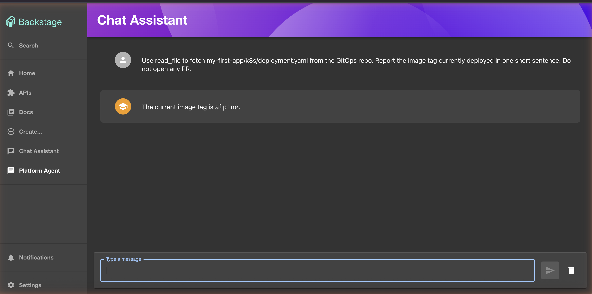

# Lab 5: End-to-End Demo Walk-Through

This lab doesn't deploy anything new. It runs the full chapter-6 loop with everything from Labs 1–4 already in place: a developer "breaks" `my-first-app` with a typo PR, ArgoCD applies the bad image, the user asks the **Platform Agent** in the Backstage chat to fix it, the agent opens its own PR, the user merges, ArgoCD reconciles, my-first-app heals — and Langfuse plus the hash-chained audit log show every step.

This is the climax the chapter has been building to. Each step has a concrete artifact to point at, in this order:

1. Backstage UI (broken state) → 2. Backstage chat (ask agent) → 3. GitHub PR (agent's proposal) → 4. Langfuse trace (reasoning) → 5. ArgoCD (reconcile) → 6. Audit log (hash chain).

## Prerequisites

- Labs 0–4 completed.
- The four long-running terminals from the [chapter root README](../README.md#terminals-youll-keep-open):
  1. Backstage `yarn start` on the host
  2. `port-forward svc/agent-runtime 18080:80`
  3. `port-forward svc/langfuse 13000:3000`
  4. A free terminal for `kubectl`, `curl`, `git`, `gh`

If any port-forward dropped (they exit when their pod restarts or when you close the shell), bring it back before continuing.

## Pre-flight check

Run this in the free terminal. Every line should pass.

```bash
echo "=== cluster ==="
kubectl get applications -n argocd
# Expect: agent-platform, langfuse, my-first-app — all Synced/Healthy

echo "=== agent-platform pods ==="
kubectl -n agent-platform get pods
# Expect: agent-runtime ... 1/1 Running   gitops-mcp ... 1/1 Running

echo "=== langfuse pods ==="
kubectl -n langfuse get pods
# Expect: langfuse ... 1/1 Running   langfuse-postgres ... 1/1 Running

echo "=== my-first-app pods ==="
kubectl -n default get pods -l app=my-first-app
# Expect: 2 pods, both 1/1 Running on image nginx:alpine

echo "=== Backstage backend ==="
curl -sS -o /dev/null -w "backend: %{http_code}\n" http://localhost:7007/healthcheck
# Any 2xx/3xx/4xx is fine — confirms the port is bound. 200 ideal.

echo "=== port-forwards ==="
curl -sS -o /dev/null -w "agent: %{http_code}\n"    http://localhost:18080/healthz
curl -sS -o /dev/null -w "langfuse: %{http_code}\n" http://localhost:13000/api/public/health
# Both 200.
```

If anything fails, fix that first — the rest of the lab assumes a healthy starting line.

## Step 1: Break my-first-app (simulating a developer typo)

Run this in the free terminal. Replace `COMPONENTS_REPO` with your local path.

```bash
COMPONENTS_REPO=~/work/backstage-components
cd "$COMPONENTS_REPO"
git checkout main && git pull --ff-only

# macOS BSD sed; Linux GNU users drop the empty argument
sed -i '' 's|nginx:alpine|nginx:bogus-tag-does-not-exist|' my-first-app/k8s/deployment.yaml

git checkout -b demo/break-image-tag
git commit -am "demo: break my-first-app image tag (simulating a typo)"
git push -u origin demo/break-image-tag
gh pr create --fill && gh pr merge --merge --delete-branch
```

ArgoCD's ApplicationSet polls every ~3 minutes, so the bad image will be applied within that window. Watch:

```bash
kubectl -n default get pods -l app=my-first-app -w
```

A new pod appears with `STATUS=ErrImagePull` (it will cycle through `ImagePullBackOff` too). The two old pods stay `Running` until the new one becomes Ready, which it never will. The deployment is stuck. Press Ctrl-C when you've seen the failure.

## Step 2: Notice the failure

Backstage's catalog page shows `my-first-app` is registered, but it doesn't surface pod-level health out of the box (the chapter-5 labs don't wire `@backstage/plugin-kubernetes`). The two places you actually see the failure are:

- **ArgoCD UI** — `kubectl port-forward svc/argocd-server -n argocd 8080:443` then https://localhost:8080. The `my-first-app` Application goes from green to a degraded/progressing state with the pod stuck in `ImagePullBackOff`. This is the cluster-truth view.
- **The Chapter 5 Chat Assistant** — if you completed chapter-5 Lab 4, the in-process langgraph agent has the kubectl actions wired. Open the **Chat Assistant** (not Platform Agent yet) in the Backstage sidebar and ask:

  > *Are any pods in the default namespace failing? If so, why?*

  It fans out the kubectl actions, surfaces the broken pod, and reports the `ImagePullBackOff` reason. This is the *Workflow vs Agent* distinction made visible — the Chat Assistant is a Stage-2/3 system answering a structured question through a fixed action set; the Platform Agent we'll use next is Stage-4 reasoning autonomously about a fix.

You don't strictly need either step before invoking the Platform Agent — the agent reads the Git repo, not the cluster — but seeing the broken state first matches a real on-call pager: a developer notices something wrong, then escalates to the agent.

## Step 3: Drive the fix from the Platform Agent chat

Still in Backstage at http://localhost:3000, click **Platform Agent** in the sidebar (this is the new entry from Lab 3).

Ask:

> *my-first-app is failing with ErrImagePull / ImagePullBackOff. The deployment lives at my-first-app/k8s/deployment.yaml in the GitOps repo. Diagnose and open a PR to fix it.*

The chat takes a few seconds — behind the scenes the agent is:

1. Loading SOUL.md / IDENTITY.md / USER.md / MEMORY.md into the system prompt.
2. Matching the intent against discovered skills; `fix-image-tag` wins.
3. Calling `consult_skill("fix-image-tag")` to load the full procedure.
4. Calling `read_file("my-first-app/k8s/deployment.yaml")` via `gitops-mcp`.
5. Identifying the bad tag and choosing `:alpine` from MEMORY.md (which Lab 1 saved).
6. Calling `open_pull_request(...)` via `gitops-mcp`.
7. The `AlwaysPRHook` validates the title/body, lets the call through.
8. The audit hook writes two lines to `AUDIT.log`.
9. The Langfuse hook closes the trace.

The chat replies with something like:

> Pull request #N is open: https://github.com/<your>/backstage-components/pull/N
> 
> Changed the image tag from `:bogus-tag-does-not-exist` to `:alpine` to fix the ImagePullBackOff. Merge the PR and ArgoCD will reconcile the working image.

For a non-fix flow that exercises the same path, you can also just ask the agent to read the manifest:



## Step 4: Read the agent's PR

Open the PR URL the chat returned:


Inspect three things:

- **Title** starts with `[agent]` — required by the `AlwaysPRHook`. If you remove that prefix in the SKILL.md and re-run the demo, the hook rejects the call and the chat reports the rejection back to you.
- **Body** has a one-paragraph rationale: symptom, root cause, before/after, consequence. Required by the same hook (≥20 chars).
- **Diff** is exactly one line: `image: ...:bogus-tag-does-not-exist` → `image: ...:alpine`. The agent does whole-file replace, not surgical edits — but the only thing that changed is the tag. (Open the *Files changed* tab to confirm.)

## Step 5: See the trace in Langfuse

Open http://localhost:13000 and go to **Traces**. Filter by `session: <whatever you used in the chat — Backstage generates one>`. You'll see one trace named `platform-ops.invoke`, with one span inside it: `tool:read_file`, plus another `tool:open_pull_request` (or one merged span depending on order). Click into the span to see the input arguments and duration.

What's worth pointing out for the chapter:

- The trace is keyed by **session_id and user_id** (Backstage propagates `user:default/guest` or similar via the proxy module). That's the identity propagation thread the chapter discusses, in this small case.
- Token / cost data shows up after a few seconds depending on the model. For the LLM call itself you'll need v3 + OTel for full prompt/response capture; v2 with our SDK callback gives you span timings. The chapter's *Going to production* table maps this LIMIT to "Langfuse Cloud or self-hosted v3" for production.

## Step 6: Merge the agent's PR

Either through the PR UI ("Merge pull request") or from the terminal:

```bash
gh pr merge <N> --repo <your>/backstage-components --merge --delete-branch
```

ArgoCD's ApplicationSet polls again within ~3 minutes. Watch the recovery:

```bash
kubectl -n default get pods -l app=my-first-app -w
# The bad pod is replaced; the new pod pulls nginx:alpine and goes Running.
# Two pods 1/1 Running. Ctrl-C.
```

## Step 7: Verify the audit log

The agent's two tool calls (`read_file` + `open_pull_request`) wrote four lines to the audit log (one before, one after, per call). Read it:

```bash
kubectl -n agent-platform exec deploy/agent-runtime -- cat /state/audit/AUDIT.log
```

Each line is a JSON record with `ts`, `phase`, `tool`, `prev_hash`, `hash`, and either `tool_args` (before) or `ok` (after). The chain runs from the genesis hash (sixty-four zeros) and links each record to the previous one's hash.

Verify the chain:

```bash
kubectl -n agent-platform exec deploy/agent-runtime -- python3 -c "
import json, hashlib
prev = '0' * 64
ok = True
with open('/state/audit/AUDIT.log') as f:
  for line in f:
    rec = json.loads(line)
    digest = rec.pop('hash')
    body = json.dumps(rec, sort_keys=True, separators=(',',':'))
    if hashlib.sha256(body.encode()).hexdigest() != digest:
      print('BAD CHAIN'); ok = False
    if rec.get('prev_hash') != prev:
      print('BAD prev_hash'); ok = False
    prev = digest
print('chain OK' if ok else 'chain BROKEN')
"
```

Tamper test: open AUDIT.log inside the pod and change one character of any record. Re-run the verifier. It now prints `BAD CHAIN` for that record and every record after it.

## What you just demonstrated

| Chapter section | The thing you saw |
|---|---|
| *A Strands Agent as a Service* | The chat in Backstage is a thin client; the agent runs in a separate pod with its own lifecycle. |
| *Memory in two layers* | The agent picked `:alpine` because MEMORY.md (the deliberate, agent-writable layer) contains the user's preference recorded in Lab 1. SOUL/IDENTITY/USER (deliberate, GitOps) shaped the rest of the response. |
| *Skills as Procedural Knowledge* | The `fix-image-tag` skill — discovered at startup, body fetched on demand — drove the diagnosis-and-PR pattern. Without it the model would have improvised; with it the steps are predictable. |
| *Domain-Scoped MCP Servers* | gitops-mcp is the only path the agent has to mutate anything. The chapter argues for one MCP per domain; this lab demonstrates one in production. |
| *Governed Writes via Hooks* | The PR title and body weren't malformed because the `AlwaysPRHook` would have rejected them. Run the demo with a deliberately bad title in the SKILL.md to see the rejection in action. |
| *Bounded blast radius* | Nothing the agent did touched the cluster. Every change was a Git commit on a branch, a PR, a human merge, an ArgoCD reconcile. The agent's blast radius is whatever the human approves. |
| *Observability and Audit* | Langfuse for the LLM-aware view, the audit log for the tamper-evident view. Two layers, different threat models. |
| *The recursive moment of Chapter 7* | Both the agent and the gitops-mcp were deployed by the same ApplicationSet that ships my-first-app. The platform that deploys the agent is the platform the agent later consumes. |

## Variants worth trying

Each takes about as long as the basic flow above and exercises a different piece of the architecture.

- **Replicas instead of image tag.** Edit `replicas: 2` to `replicas: 0` in `my-first-app/k8s/deployment.yaml`, merge, then ask the Platform Agent to "scale my-first-app back to 2 replicas". You'll see the agent fail (no skill matches) and stop instead of hallucinate — the chapter's *If you cannot identify a safe replacement, stop and ask* rule from the SKILL.md fires. Then add a `scale-deployment` skill of your own and rerun. (This is what Lab 6 turns into a Backstage template.)

- **Hook-rejected PR.** Edit the SKILL.md's instructions to omit the `[agent]` prefix from the PR title. Rerun the demo. The chat returns "Hook rejected open_pull_request: title must start with '[agent] '." That's the difference between prompt-level guidance and code-level enforcement.

- **Multi-step fix.** Break two things at once (image tag and replicas). The current `fix-image-tag` skill handles only one. The agent will fix the image and ask about the replicas, or — depending on how you phrased the intent — open one PR and miss the other. The chapter's *Specialist agents and the cycle of architecture* section is about this.

## Where to go from here

- **Chapter 7 narrative:** the *Building It* section can now point readers at concrete artifacts (this lab) instead of abstractions.
- **Lab 6 (bonus):** add a Backstage scaffolder template `add-skill` that lets domain teams contribute a new skill without touching the agent's code. The template ends with a PR to `lusoal/backstage-components` adding a new ConfigMap-mounted SKILL.md, plus an updated agent deployment that mounts it. That makes Stage-1-3 (deterministic templates) and Stage-4 (autonomous agent) coexist on the same Backstage portal — the *Workflow vs Agent* spectrum, materialized as two columns of the same sidebar.
- **Going to production** (chapter table): every component in this demo has a managed substitute. The architecture stays; the operational substrate moves up. Useful exercise: pick one row (e.g., the audit log) and migrate it (e.g., to S3 with Object Lock in a separate AWS account) to feel the difference.
